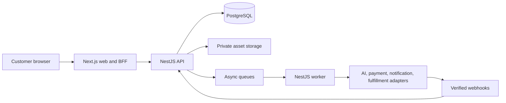

# Souvenote engineering architecture

Status: approved target architecture; implementation is incremental.
Do not assume target components already exist.

## Current and target layout

Current:

```text
front end/          Next.js application
backend/server/     NestJS API
backend/database/   draft SQL migrations and seed
backend/docs/       legacy notes
```

Target:

```text
apps/
  web/              Next.js frontend
  api/              NestJS HTTP API
  worker/           async generation/payment/fulfillment worker
packages/
  contracts/        generated OpenAPI client and shared contract types
  config/           shared TypeScript, lint, and test configuration
database/            migrations and deterministic seeds
infra/               AWS CDK TypeScript
docs/                product, engineering, operations, and runbooks
```

Use npm workspaces and one lockfile after the Section 1 migration. Perform path moves in a dedicated change, preserving Git history and behavior.

## System shape



This is a modular monolith, not a microservice system. The API and worker are independently deployable processes that share domain modules and one PostgreSQL database.

## Dependency direction

- `web -> contracts`
- `api controllers -> application/domain services -> repositories/adapters`
- `worker handlers -> application/domain services -> repositories/adapters`
- `repositories -> PostgreSQL`
- `adapters -> external provider SDKs`

Forbidden dependencies:

- Web importing API implementation files.
- Controllers executing SQL or containing pricing/credit/payment rules.
- Domain services importing provider SDKs directly.
- Adapters changing credits, orders, or payments without a domain service transaction.
- Infrastructure packages containing secrets or product business rules.

## Frontend state ownership

- TanStack Query: remote users, pricing, credits, entitlements, drafts, jobs, assets, orders, and fulfillment status.
- Focused Zustand stores: ephemeral wizard answers, review UI selections, and temporary cart choices before server persistence.
- React state: isolated inputs and presentation.
- Server/API: authoritative business and lifecycle state.

Do not add Tailwind. Preserve existing tokens and gradually isolate global CSS into component/route modules. Existing oversized components must not grow.

## API conventions

- Prefix public application APIs with `/api/v1`.
- Generate the web client from the Nest OpenAPI document.
- Authenticate by default; explicitly mark only health, pricing where intended, public share, and verified webhook routes public.
- Derive user identity from a validated Cognito access token.
- Require `Idempotency-Key` for monetary, credit, generation, checkout, order, webhook, and fulfillment mutations.
- Use bounded cursor pagination for collections.
- Use request IDs and a stable error envelope.

```ts
export type ApiError = {
  code: string;
  message: string;
  requestId: string;
  details?: Record<string, unknown>;
};
```

Primary resource groups are `me`, `pricing`, `credits`, `card-entitlements`, `card-drafts`, `uploads`, `generation-jobs`, `assets`, `orders`, `checkout`, `fulfillment-jobs`, public share links, and provider webhooks.

## State contracts

```ts
export type AssetGenerationStatus =
  | "pending"
  | "generating"
  | "ready"
  | "failed";

export type GenerationJobStatus =
  | "queued"
  | "running"
  | "succeeded"
  | "partially_failed"
  | "failed"
  | "refunded"
  | "canceled"
  | "approved";

export type UploadStatus =
  | "upload_pending"
  | "upload_done"
  | "moderation_pending"
  | "moderation_passed"
  | "moderation_failed"
  | "attestation_required"
  | "attestation_done"
  | "committed";
```

Transitions must be validated by domain services and constrained where practical in PostgreSQL. Clients do not write lifecycle status directly.

## Database

Use PostgreSQL and explicit SQL through repository modules.

The pre-launch baseline includes users/auth identities, credit ledger, card entitlements, price books, drafts/revisions, uploads, generation jobs/provider attempts, assets/share metadata, orders/items, payments/webhook events, fulfillment jobs/tracking, notifications, feature flags, and audit events.

Rules:

- A migration journal records version, checksum, and applied time.
- Applied migrations are immutable.
- Money uses integer minor units and ISO currency.
- Credit balance changes are atomic ledger transactions.
- Ownership foreign keys and query indexes are mandatory.
- External IDs and idempotency keys are unique.
- Uncommitted uploads expire after 24 hours.
- Do not pre-create speculative feature tables.

## Authentication and security

- Next.js acts as a BFF for Cognito authorization-code/PKCE and stores application sessions in secure HTTP-only cookies.
- Nest validates Cognito access tokens, issuer, client, expiry, token use, and scopes.
- Apply authentication and ownership globally by default.
- Use environment-specific CORS allowlists, secure headers, CSRF protection for cookie-backed mutations, rate limits, body limits, and redacted structured logs.
- Use Stripe-hosted payment elements. Souvenote never handles raw card data.
- Validate actual upload bytes, type, dimensions, and size; moderate before commit or fulfillment.

## Provider architecture

Providers implement typed interfaces for image, music, text, moderation, payment, notification, and fulfillment work. Each provider has deterministic mock and disabled implementations.

External calls record provider/model/version, input hash, attempt, timing, result key, moderation, cost, reserved/refunded credits, and sanitized error category.

No provider receives paid/live traffic until schemas, rate limits, moderation, audit logs, retry/refund behavior, cost controls, and explicit approval are complete.

## Scalability rules

- Web, API, and worker processes are stateless.
- Store media in object storage, not the database or container filesystem.
- Queue long-running work and bound provider concurrency.
- Make all handlers safe under retries and duplicate delivery.
- Do not hold database transactions open during external calls.
- Index known query patterns and test pagination.
- Use feature flags for provider and market activation.
- Scale the modular monolith before splitting services.

## Observability and privacy

- Structured logs include request/job/order IDs, never sensitive payloads.
- Sentry receives sanitized errors.
- PostHog receives PII-free funnel events only.
- Audit logs cover authentication, credits, pricing decisions, payments, orders, fulfillment, and administrative changes.
- Operational alarms cover API error rate/latency, database pressure, queue age/depth, dead letters, provider failure, webhook lag, payment mismatch, and fulfillment failure.
