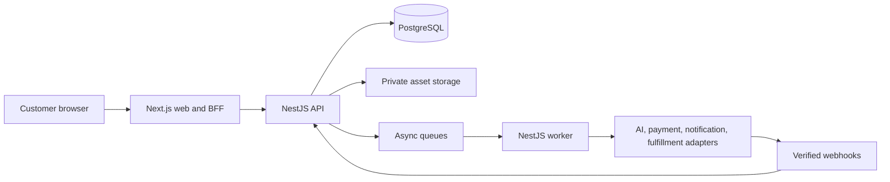

# Souvenote engineering architecture

Status: approved architecture; the Section 2 schema, contracts, and security boundary is implemented on `codex/section-2-schema-contracts-security` pending final stacked-PR checks.

## Current workspace layout

```text
apps/
  web/              Next.js frontend
  api/              NestJS HTTP API
  worker/           async worker process; health-only/idle until later sections
packages/
  contracts/        generated OpenAPI document, TypeScript schemas, and web client
  config/           shared TypeScript, lint, and test configuration
database/            verified MVP baseline, SHA-256 journal, runner, and isolated tests
infra/               infrastructure boundary; presence does not authorize deployment
docs/                product, engineering, operations, and runbooks
```

The repository uses npm workspaces, one root lockfile, and Node.js 22/npm 10.9.8 as the canonical toolchain. Section 2 preserves the visual system while replacing browser token authority and legacy API authority with a generated, owner-scoped boundary. Operational worker job handlers remain later bounded sections.

Historical backend and frontend notes live under `docs/legacy/` and are explicitly non-authoritative. Their commands, paths, APIs, and product behavior must not be copied into current implementation without reconciliation.

## System shape



This is a modular monolith, not a microservice system. The API and worker are independently deployable processes that share domain modules and one PostgreSQL database.

For Section 1 local development, the native processes and database use these loopback endpoints:

- Web health: `http://127.0.0.1:3000/api/health`
- API liveness/readiness: `http://127.0.0.1:4000/api/v1/health/live` and `http://127.0.0.1:4000/api/v1/health/ready`
- Worker liveness/readiness: `http://127.0.0.1:4001/health/live` and `http://127.0.0.1:4001/health/ready`
- PostgreSQL 16: `127.0.0.1:55432`

The worker deliberately performs no generation, payment, or fulfillment jobs yet. PostgreSQL readiness proves connectivity only. Ordinary startup verifies the migration journal without applying it; `dev:setup` and stack smoke are explicit migration actions.

## Dependency direction

- `web -> contracts`
- `api controllers -> application/domain services -> repositories/adapters`
- `worker handlers -> application/domain services -> repositories/adapters`
- `repositories -> PostgreSQL`
- `adapters -> external provider SDKs`

Forbidden dependencies:

- Web importing API implementation files.
- Controllers executing SQL or containing pricing/credit/payment rules.
- Domain services importing provider SDKs directly.
- Adapters changing credits, orders, or payments without a domain service transaction.
- Infrastructure packages containing secrets or product business rules.

## Frontend state ownership

- TanStack Query: remote users, pricing, credits, entitlements, drafts, jobs, assets, orders, and fulfillment status.
- Focused Zustand stores: ephemeral wizard answers, review UI selections, and temporary cart choices before server persistence.
- React state: isolated inputs and presentation.
- Server/API: authoritative business and lifecycle state.

Do not add Tailwind. Preserve existing tokens and gradually isolate global CSS into component/route modules. Existing oversized components must not grow.

## API conventions

- Prefix public application APIs with `/api/v1`.
- Generate the web client from the Nest OpenAPI document.
- Authenticate by default; explicitly mark only health, pricing where intended, public share, and verified webhook routes public.
- Derive user identity from a validated Cognito access token.
- Require `Idempotency-Key` for monetary, credit, generation, checkout, order, webhook, and fulfillment mutations.
- Use bounded cursor pagination for collections.
- Use request IDs and a stable error envelope.

```ts
export type ApiError = {
  code: string;
  message: string;
  requestId: string;
  details?: Record<string, unknown>;
};
```

Primary resource groups are `me`, `pricing`, `credits`, `card-entitlements`, `card-drafts`, `uploads`, `generation-jobs`, `assets`, `orders`, `checkout`, `fulfillment-jobs`, public share links, and provider webhooks.

The public CAD pricing response contains separate physical-card and standalone
credit-pack collections. Authenticated credit-pack purchase mutations select only
an offer code; the API snapshots the server-owned CAD amount and credit quantity.
The deterministic mock purchase route is restricted to development/test mock
payment mode and grants through the same idempotent ledger used by other credits.
Section 5 replaces mock capture with verified Stripe-hosted payment state.

Section 2 uses `/api/v1` for all product and health routes. The Next.js BFF exposes generated-client calls at `/api/bff/api/v1/*`, injects the server-held access token, enforces same-origin CSRF checks on mutations, and never returns access or refresh tokens to browser code.

## State contracts

```ts
export type AssetGenerationStatus = 'pending' | 'generating' | 'ready' | 'failed';

export type GenerationJobStatus =
  'queued' | 'running' | 'succeeded' | 'partially_failed' | 'failed' | 'refunded' | 'canceled' | 'approved';

export type UploadStatus =
  | 'upload_pending'
  | 'upload_done'
  | 'moderation_pending'
  | 'moderation_passed'
  | 'moderation_failed'
  | 'attestation_required'
  | 'attestation_done'
  | 'committed';
```

Transitions must be validated by domain services and constrained where practical in PostgreSQL. Clients do not write lifecycle status directly.

## Database

Use PostgreSQL and explicit SQL through repository modules.

Local development uses PostgreSQL 16 bound only to `127.0.0.1:55432`. The normal shutdown path preserves its named Docker volume. No root startup, readiness, health, test, or CI command may auto-run the legacy draft migrations. The verified pre-launch baseline is a Section 2 deliverable.

The verified pre-launch baseline includes users/auth identities, hashed sessions, general idempotency records, credit ledger, card entitlements, price books, drafts/revisions, uploads, generation jobs/provider attempts, assets/share metadata, orders/items, payments/webhook events, fulfillment jobs/tracking, notifications, feature flags, and audit events. The deleted draft migrations were never production history.

Additive Section 3 migrations publish the physical-card catalog and standalone
credit-pack offers, plus durable owner-scoped reservation, authorization, and
credit-pack purchase snapshots. Applied files remain immutable.

Rules:

- A migration journal records version, checksum, and applied time.
- Applied migrations are immutable.
- Money uses integer minor units and ISO currency.
- Credit balance changes are atomic ledger transactions.
- Ownership foreign keys and query indexes are mandatory.
- External IDs and idempotency keys are unique.
- Uncommitted uploads expire after 24 hours.
- Do not pre-create speculative feature tables.

## Authentication and security

- Next.js acts as a BFF for Cognito authorization-code/PKCE and stores encrypted application sessions in secure HTTP-only SameSite cookies.
- Nest validates Cognito access tokens, issuer, client, expiry, token use, and scopes.
- Apply authentication and ownership globally by default. Only decorated health, public CAD pricing/share, and signature-verified webhook routes bypass customer authentication.
- Use environment-specific CORS allowlists, secure headers, CSRF protection for cookie-backed mutations, rate limits, body limits, and redacted structured logs.
- Use Stripe-hosted payment elements. Souvenote never handles raw card data.
- Validate actual upload bytes, type, dimensions, and size; moderate before commit or fulfillment.

Credential-free local/test authentication signs a short-lived access token and exercises the same BFF cookie and repository ownership boundary. It is rejected outside development/test, and both BFF and API require loopback networking. Cognito mode fails closed when issuer, client, scope, key, or cookie configuration is missing.

Production activation note: the selected Cognito user-pool access-token configuration must include the verified email identity claim expected by provisioning (for example through an approved pre-token-generation configuration). This is a staging activation gate, not a local fallback.

## Provider architecture

Providers implement typed interfaces for image, music, text, moderation, payment, notification, and fulfillment work. Each provider has deterministic mock and disabled implementations.

External calls record provider/model/version, input hash, attempt, timing, result key, moderation, cost, reserved/refunded credits, and sanitized error category.

No provider receives paid/live traffic until schemas, rate limits, moderation, audit logs, retry/refund behavior, cost controls, and explicit approval are complete.

Section 1 provider modes are deterministic mock or disabled. Workspace startup, health checks, builds, tests, and smoke checks require no provider credentials and produce no AWS or third-party metered traffic.

## Scalability rules

- Web, API, and worker processes are stateless.
- Store media in object storage, not the database or container filesystem.
- Queue long-running work and bound provider concurrency.
- Make all handlers safe under retries and duplicate delivery.
- Do not hold database transactions open during external calls.
- Index known query patterns and test pagination.
- Use feature flags for provider and market activation.
- Scale the modular monolith before splitting services.

## Observability and privacy

- Structured logs include request/job/order IDs, never sensitive payloads.
- Sentry receives sanitized errors.
- PostHog receives PII-free funnel events only.
- Audit logs cover authentication, credits, pricing decisions, payments, orders, fulfillment, and administrative changes.
- Operational alarms cover API error rate/latency, database pressure, queue age/depth, dead letters, provider failure, webhook lag, payment mismatch, and fulfillment failure.
